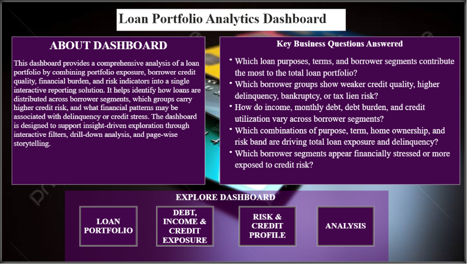

# 📊 Loan Portfolio & Borrower Risk Analytics Dashboard

An interactive, story-driven **Power BI** dashboard built to analyze a bank's loan portfolio across four dimensions — portfolio composition, borrower credit quality, financial burden, and risk contribution. Every page is designed around a specific business question rather than a random collection of charts.

---


## 🎯 About the Dashboard

This dashboard combines portfolio exposure, borrower credit quality, financial burden, and risk indicators into a single interactive reporting solution. It helps identify how loans are distributed across borrower segments, which groups carry higher credit risk, and what financial patterns are associated with delinquency or credit stress — supported by filters, drill-down, and page-wise storytelling.

### Key Business Questions Answered

- Which loan purposes, terms, and borrower segments contribute the most to the total loan portfolio?
- Which borrower groups show weaker credit quality, higher delinquency, bankruptcy, or tax lien risk?
- How do income, monthly debt, debt burden, and credit utilization vary across borrower segments?
- Which combinations of purpose, term, home ownership, and risk band drive total loan exposure and delinquency?
- Which borrower segments appear financially stressed or more exposed to credit risk?

---

## 🗂️ Dataset

Built on the Kaggle **Loan Prediction / Credit Train** dataset.

**Features used:** Current Loan Amount, Term, Credit Score, Annual Income, Years in Current Job, Home Ownership, Purpose, Monthly Debt, Years of Credit History, Months Since Last Delinquent, Number of Open Accounts, Number of Credit Problems, Current Credit Balance, Maximum Open Credit, Bankruptcies, Tax Liens.

---

## 🧹 Data Cleaning & Transformation

| Step | Detail |
|---|---|
| Removed columns | Loan ID, Customer ID |
| Missing values | Credit Score & Annual Income filled with **Median** |
| Invalid values | `99999999` loan amounts replaced with `NULL` |
| Credit Score fix | Values > 1000 corrected by dividing by 10 |
| Years in Job | Converted to numeric (`< 1 year → 0`, `1 year → 1`, … `10+ years → 10`) |
| Other | Corrected data types, removed duplicates, created calculated fields |

---

## 🖥️ Dashboard Pages

### 🏠 Home
Navigation hub with an "About the Dashboard" summary, the key business questions, and buttons to jump into each page: **Loan Portfolio**, **Debt, Income & Credit Exposure**, **Risk & Credit Profile**, and **Analysis**.

### 1️⃣ Loan Portfolio Overview
> *What does the overall loan portfolio look like?*

**KPIs:** Avg Annual Income `1.40M` · Avg Loan Amount `310.54K` · Loan Count `5K` · Total Loan Amount `1.30bn`

**Visuals:** Portfolio Split by Loan Term (donut) · Loan Amount Distribution Across Income Bands · Loan Portfolio by Purpose · Purpose-wise Contribution to Total Loan Portfolio (waterfall) · Loan Exposure by Home Ownership

**Filters:** Purpose · Term · Home Ownership · Income Band

**Insight:** Debt Consolidation is the top purpose by loan amount, Long Term loans dominate the portfolio mix, and Home Mortgage borrowers carry the highest exposure.

### 2️⃣ Borrower Risk & Credit Profile
> *Which borrower groups appear riskier?*

**KPIs:** Tax Lien Rate `0.02` · Bankruptcy Rate `0.10` · Avg Credit Score `991.68` · Delinquency Rate `1.00`

**Visuals:** Portfolio Credit Quality Gauge · Loan Amount vs Credit Score by Borrower Risk Segment (scatter) · Delinquency Rate by Home Ownership · Bankruptcy Rate (pie) · Average Credit Score by Loan Purpose · Borrower Risk Band Distribution by Loan Term (stacked bar)

**Filters:** Term · Purpose · Home Ownership · Credit Score Risk Band · Delinquency Flag

**Insight:** Long Term loans show a larger concentration of Poor/Fair credit bands, and the Rent segment shows higher delinquency than Home Mortgage borrowers.

### 3️⃣ Debt, Income & Credit Exposure
> *Which borrowers appear financially stressed?*

**KPIs:** Avg Credit Utilization `0.47` · Avg Monthly Debt `19.00K` · Avg Debt-to-Income Ratio `0.17` · Avg Open Accounts `11.40` · Avg Years of Credit History `19.29`

**Visuals:** Utilization Health Gauge · Credit Utilization by Home Ownership · Credit Balance vs Maximum Open Credit (scatter) · Debt Burden Distribution (pie) · Loan Amount / Credit Score / Home Ownership / Purpose / Credit Utilization (bubble) · Monthly Debt by Income Band

**Filters:** Debt Burden Band · Utilization Band · Term · Home Ownership · Income Band

**Insight:** The 25L+ income band carries the highest average monthly debt, and Low Burden borrowers dominate the portfolio by count.

### 4️⃣ Analysis (Root Cause Analysis)
> *Which borrower segments contribute most to portfolio risk?*

**Visuals:** Decomposition Tree (Total Loan Amount by Purpose → Term → Home Ownership → Income Band → Credit Score Risk) · Delinquency Rate drill-down decomposition tree · Risk Contribution Pie · Matrix (Term × Purpose with Total Loan Amount, Avg Credit Score, Delinquency Rate, Avg Debt-to-Income Ratio) · Delinquency Rate Gauge

**Filters:** Purpose · Term · Home Ownership · Income Band · Credit Score Risk Band · Debt Burden Band

**Insight:** Debt Consolidation + Short Term + Home Mortgage is the single largest contributor to total loan exposure.

---

## 📐 Key DAX Measures

```DAX
Total Loans = COUNTROWS('Loan_Data')

Average Loan Amount = AVERAGE('Loan_Data'[Current Loan Amount])

Average Credit Score = AVERAGE('Loan_Data'[Credit Score])

Average Annual Income = AVERAGE('Loan_Data'[Annual Income])

Average Monthly Debt = AVERAGE('Loan_Data'[Monthly Debt])

Total Loan Amount = SUM('Loan_Data'[Current Loan Amount])
```

---

## ✨ Dashboard Features

Interactive Filters · KPI Cards · Column & Bar Charts · Line & Scatter Charts · Donut & Pie Charts · Matrix Visuals · Waterfall Charts · Decomposition Tree · Gauges · Navigation Buttons · Drill-through Analysis

---

## 🛠️ Tools Used

Microsoft Power BI Desktop · Power Query · DAX · Microsoft Excel · Kaggle Loan Dataset

---

## 📁 Repository Structure

```
Loan-Portfolio-Borrower-Risk-Analytics/
│
├── Dashboard/
│   └── Loan Portfolio Dashboard.pbix
│
├── Data/
│   ├── credit_train.csv
│   └── cleaned_credit_train.csv
│
├── Screenshots/
│   ├── Home.png
│   ├── Loan Portfolio Overview.png
│   ├── Borrower Risk & Credit Profile.png
│   ├── Debt, Income & Credit Exposure.png
│   └── Analysis.png
│
├── Documentation/
│   ├── Data Cleaning.pdf
│   ├── Dashboard Documentation.pdf
│   └── DAX Measures.pdf
│
├── Presentation/
│   └── Loan Dashboard Presentation.pptx
│
├── README.md
└── LICENSE
```

---

## 🖼️ Screenshots

### Home


### Loan Portfolio Overview


### Borrower Risk & Credit Profile


### Debt, Income & Credit Exposure


### Analysis


---

## 💡 Key Insights

- Debt Consolidation is the largest loan category by amount, followed by Home Improvement and Business Loans.
- Long Term loans make up ~60% of total loan amount and show a higher concentration of weaker credit bands than Short Term loans.
- Home Mortgage borrowers carry the highest loan exposure; Rent borrowers show relatively higher delinquency.
- The 25L+ income band carries the highest average monthly debt despite higher income, suggesting elevated financial commitments at the top end.
- Debt Consolidation + Short Term + Home Mortgage is the top combination driving total portfolio exposure.

---

## 🚧 Challenges Faced

- Handling missing values in Credit Score and Annual Income.
- Correcting inconsistent Credit Score values (scale mismatch above 1000).
- Cleaning invalid loan amount entries (`99999999`).
- Converting categorical employment tenure into numeric values.
- Designing a storytelling flow across pages instead of disconnected visuals.

---

## 🔮 Future Improvements

- Predict loan default using Machine Learning.
- Publish the dashboard via Power BI Service.
- Add real-time loan portfolio monitoring.
- Integrate SQL Server as a live data source.
- Implement Row-Level Security (RLS).

---

## ▶️ How to Use

1. Clone this repository:
   ```bash
   git clone https://github.com/yourusername/Loan-Portfolio-Borrower-Risk-Analytics.git
   ```
2. Open the `.pbix` file using **Power BI Desktop**.
3. Refresh the dataset if required.
4. Explore the dashboard using slicers, drill-through, and navigation buttons.

---

## 👤 Author

**Shubham**

---

## 📄 License

This project is created for educational and portfolio purposes.

---

⭐ If you found this project useful, consider giving the repository a star.
